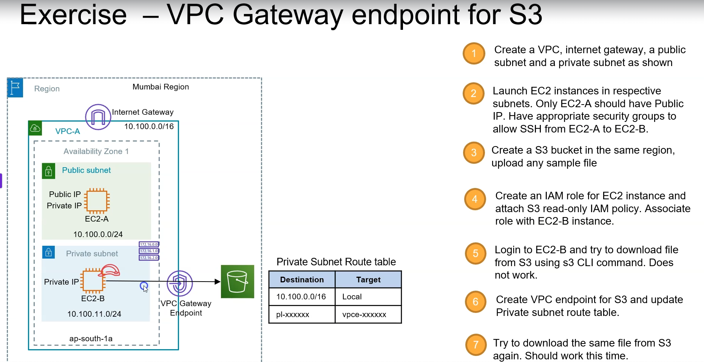
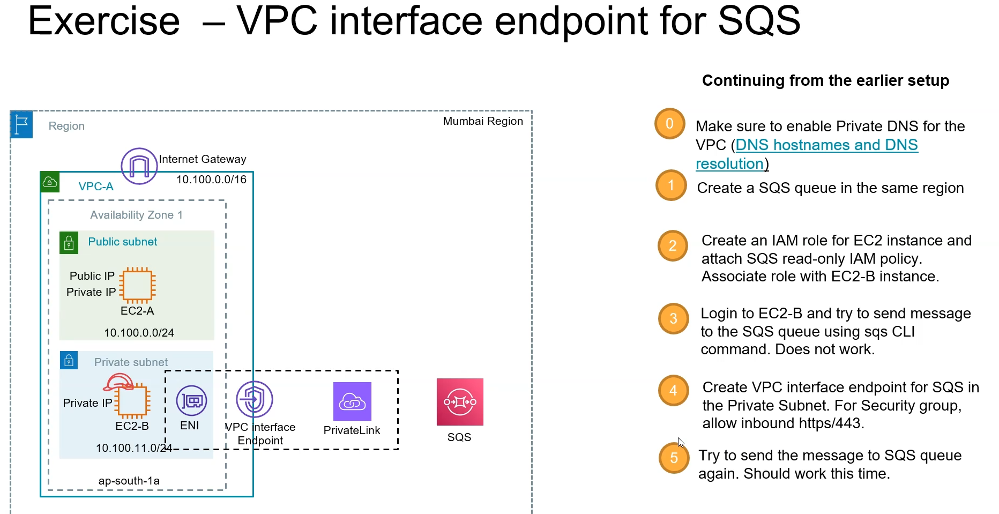
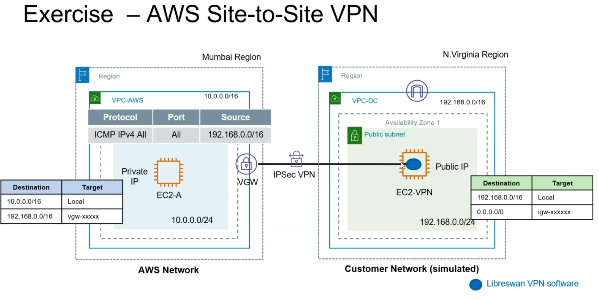

1. Create an S3 bucket in same region of VPC and see if you can access the S3 bucket from ec2 instance of private subnet?

2. Create an S3 bucket in same region of VPC and see if you can access the S3 bucket from ec2 instance of private subnet?

3. AWS Site-2-Site VPN configurations?

