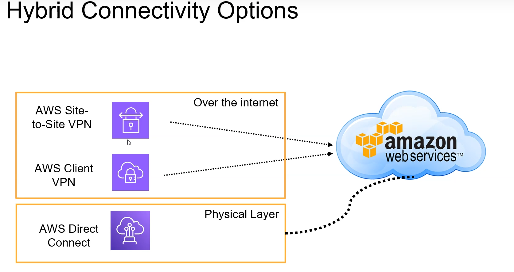
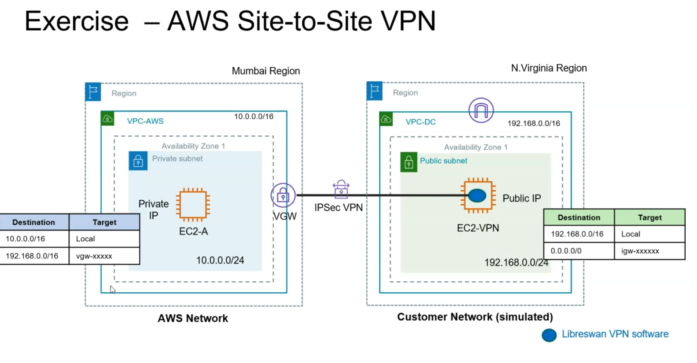
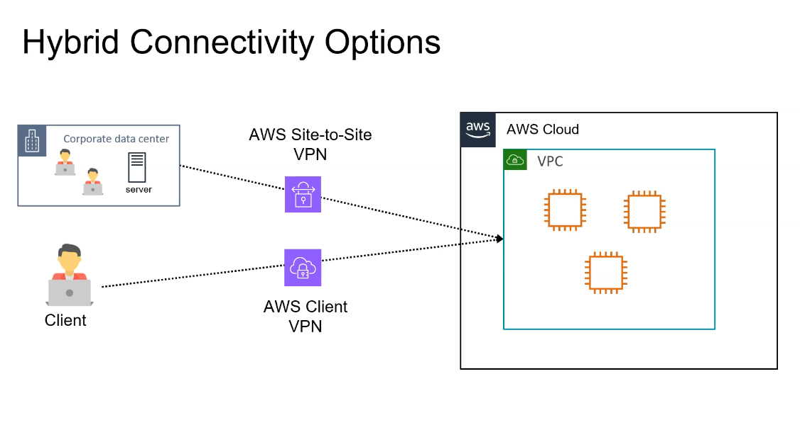
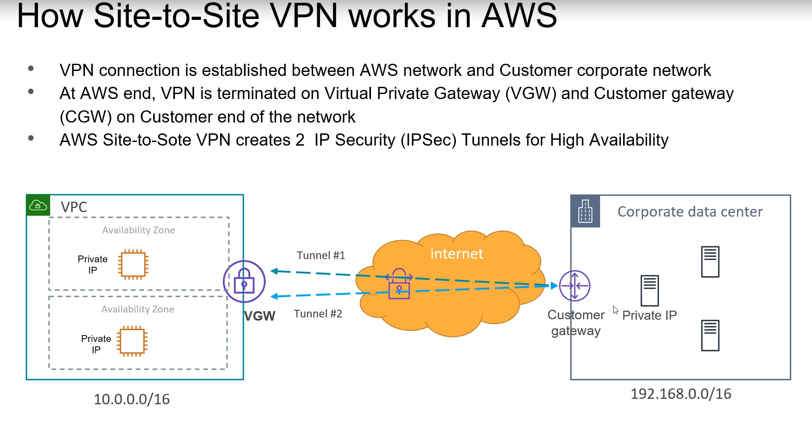
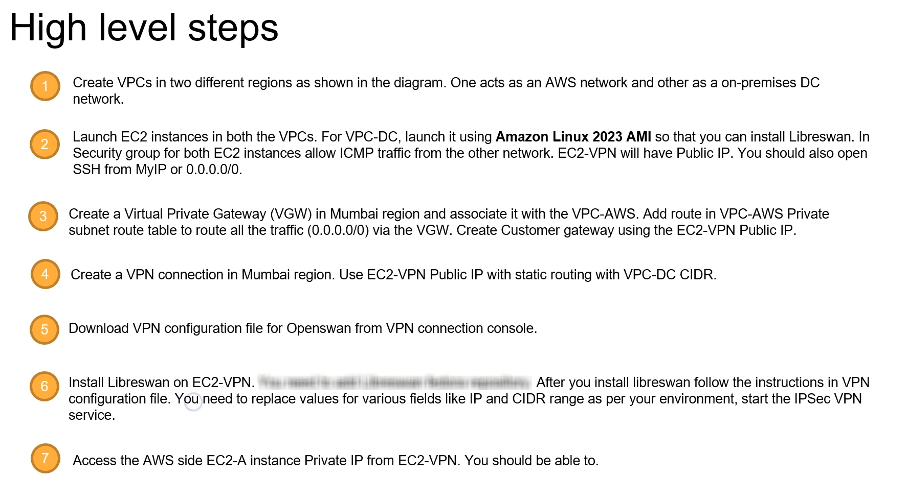

+-------------------------------------+
|               VPC A                 |
|  CIDR: 10.100.0.0/16                |
|                                     |
|  +----------------+  +------------+ |
|  | Public Subnet  |  | Private    | |
|  | 10.100.1.0/24  |  | Subnet     | |
|  |                |  | 10.100.11.0/24|
|  | +------------+ |  | +--------+ | |
|  | | EC2        | |  | | EC2    | | |
|  | | Instance   | |  | | Instance| | |
|  | | (Public IP)| |  | | (No Public| |
|  | +------------+ |  | | IP)     | | |
|  +----------------+  +------------+ |
|         |                  |        |
|         | IGWA             |        |
|         | (Internet        |        |
|         |  Gateway)        |        |
+---------|------------------|--------+
          |                  |
          |                  |
    Internet Access     No Internet Access
      (0.0.0.0/0)       (VPC Internal Only)

---

**Agent forwarding**

# Start the SSH agent
eval "$(ssh-agent -s)"

# Add your private key to the agent
ssh-add ./vpckey.pem

# Verify the key was added
ssh-add -L

---

**Site-to-Site VPN**

- Traffic still flows through the public internet and there are still packet drops etc..

